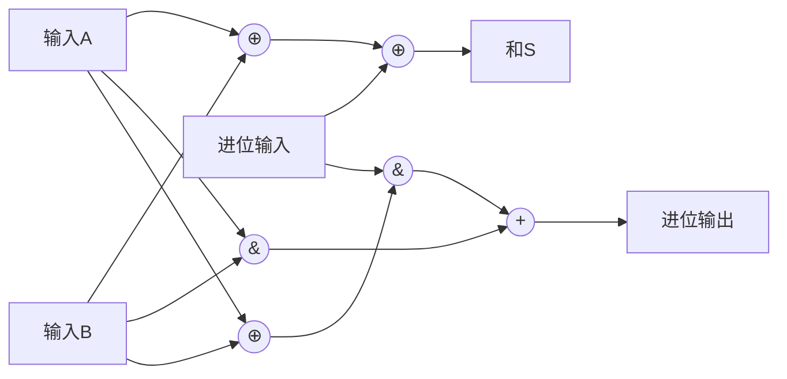

# 算术运算和逻辑运算

## 加减法运算器

### 一位全加器设计

- 基本结构
  - 三个输入：A、B（被加数）和 Cin（进位输入）
  - 两个输出：S（和）和 Cout（进位输出）
- 逻辑表达式
  - S = A ⊕ B ⊕ Cin
  - Cout = AB + (A⊕B)Cin
- 实现电路
  - 门级实现
  - 多路复用器实现

### 串行加法器

- 工作原理
  - 从最低位开始逐位相加
  - 进位触发器存储进位信息
- 时序控制
  - 移位寄存器的应用
  - 加法完成的判断
- 优缺点分析
  - 优点：硬件简单
  - 缺点：速度慢

### 并行加法器

- 先行进位链
  - 进位产生函数：Gi = Ai·Bi
  - 进位传递函数：Pi = Ai⊕Bi
  - 进位表达式：Ci+1 = Gi + Pi·Ci
- 超前进位加法器
  - 4 位 CLA 结构
  - 多级 CLA 的实现
  - 性能分析
- 带标志的加法器
  - 溢出标志
  - 进位标志
  - 零标志
  - 符号标志

### 补码加减运算电路

- 减法转加法原理
  - A-B = A+(-B)
  - 补码的减法实现
- 一位加减运算器设计
  - 加减控制信号
  - 进位/借位处理
- 多位加减运算器
  - 串行实现
  - 并行实现
  - 标志位生成

## 乘除法运算器

### 原码一位乘法器

- 基本算法
  - 部分积的生成
  - 累加操作
  - 移位操作
- 硬件结构
  - 乘数寄存器
  - 部分积寄存器
  - 计数器
- 控制流程
  - 初始化
  - 判断位值
  - 累加移位
  - 结束判断

### 补码一位乘法器

- Booth 算法原理
  - 正负数的统一处理
  - 符号位扩展
- 改进的 Booth 算法
  - 两位检查
  - 部分积的修正
- 硬件实现
  - 控制电路
  - 数据通路
  - 时序设计

### 除法运算器

- 恢复余数除法
  - 基本步骤
  - 余数判断
  - 商的确定
- 不恢复余数除法
  - 原理与特点
  - 加减交替
  - 商的生成
- 除法器的优化
  - SRT 除法
  - 高基除法
  - 除法器的流水线设计

## ALU 的基本结构

### 组合逻辑运算单元

- 基本逻辑运算
  - 与、或、非
  - 异或、同或
  - 位操作
- 多功能逻辑单元
  - 功能选择
  - 输出控制

### 算术运算单元

- 基本运算功能
  - 加减运算
  - 增量/减量
  - 求补运算
- 复杂运算支持
  - 乘除运算接口
  - 浮点运算接口

### 移位运算单元

- 基本移位操作
  - 逻辑移位
  - 算术移位
  - 循环移位
- 桶形移位器
  - 结构设计
  - 性能优化

### 状态标志位生成

- 常用标志位
  - 进位标志（CF）
  - 零标志（ZF）
  - 符号标志（SF）
  - 溢出标志（OF）
  - 奇偶标志（PF）
- 标志位应用
  - 条件转移
  - 运算控制
  - 错误检测
